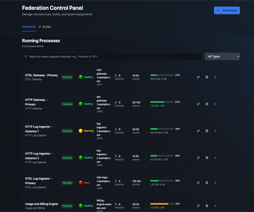
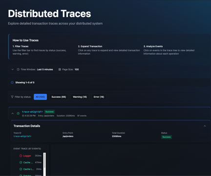
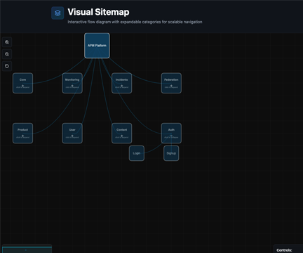

# Fast APM 
# *Next Generation Application Analytics*

## Welcome
Over a 20-year career, I’ve watched distributed applications evolve from simple, tightly coupled projects into massive, high-throughput architectures. But as our systems grew, understanding whether they were actually running smoothly became a massive headache.

The explosion of modern tech brought an explosion of monitoring tools. The problem? Most are either too narrow—forcing you to stitch together five different dashboards just to see what's going on—or they dump a mountain of data on you, leaving you to find the needle in the haystack.

FastStack APM was born out of that exact frustration. We wanted to build a different approach to application performance management: a cohesive ecosystem of purpose-built tools designed to give you true, end-to-end visibility. Whether it’s traffic analysis, user interactions for marketing, system health for DevOps, or distributed tracing for developers, FastStack handles it. It’s intuitive performance visibility built by developers, for developers.

This isn't just another dashboard to dig through. With an intelligent, AI-backed core, FastStack actively understands your system, pinpoints bottlenecks, and proactively delivers actionable feedback—saving your team time, money, and sanity.

## Filtering through the noise

The state of many monitoring tools provides a cockpit experience, as illustrated on the left. Detailed, however overwhelming. In contrast, it is often most most effective to provide a more intuitive, simplified experience.

